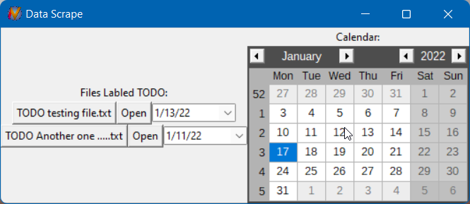

# Due Date Organizer
A way to put all of one's due dates in the same place

## Web Scraping 
Still not fully implimented

Scrape websites in order to find due dates and add them to the calendar so they're all in one place

## On Disk Assignments
Search through a file structure in order to find files starting with "TODO" and add them to the application

TODO feels natural for me as a programmer, but eventually this will be changable in settings

## Style

  

Definately not the prettiest application so far. I'll focus more on that once I have all the features I want

## Getting Started
Please remember to add your information to your personal .env file for things to work. This is set to be ignored by git.
